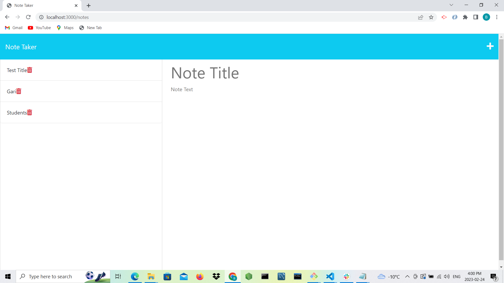

# Note Taker

This app is a modified starter code, it is called note taker. The app implements Express.js at the back end and it will save and retrieve note data from a JSON file. It is used in a way that the user will enter their infomation into the note title and text sections. Thereafter, a save button will reveal at the right side. When the save button is click, the information entered at the sections will display at the left side. Equally, the displayed information at left side can be delete.

## Generated images

## Deployed URL and Repository:

https://bamidele100.github.io/note-taker/

https://github.com/Bamidele100/note-taker.git

## Heroku URL

https://note-taker-production.herokuapp.com/

